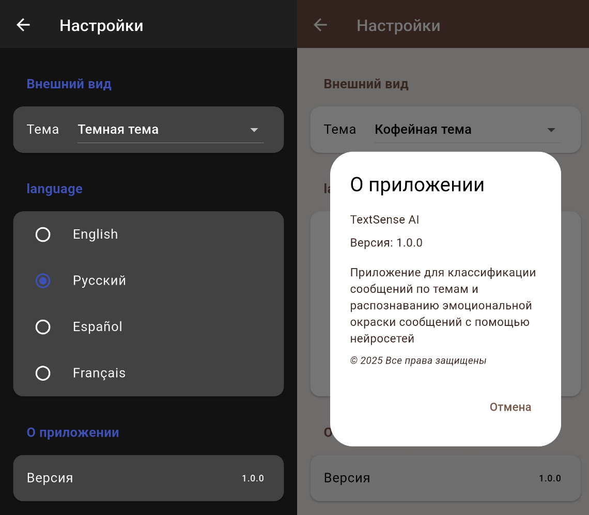
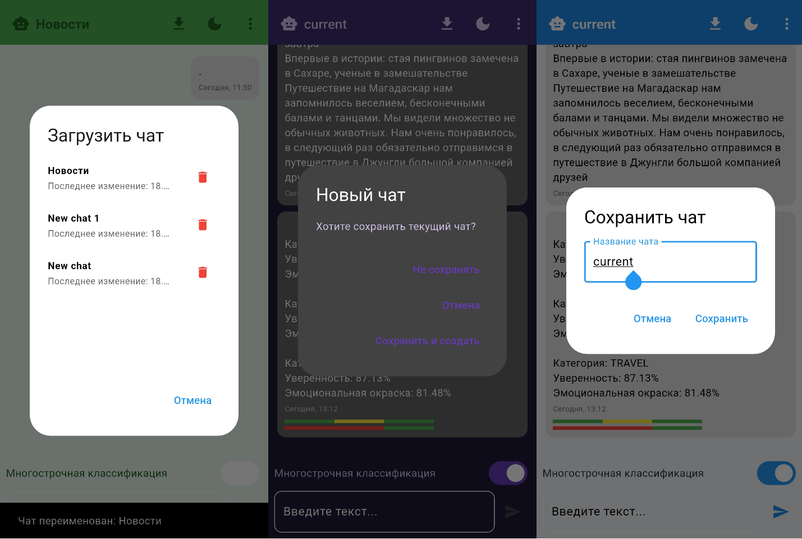
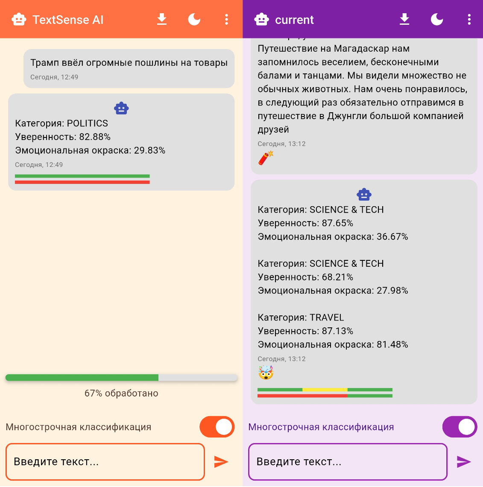

<p align="center">
  
</p>

<h1 align="center">TextSense AI</h1>
<p align="center">
Интеллектуальный анализ текста: темы • тональность • перевод.  
Flutter + Flask + PyTorch
<br><br>


</p>

---

## 1. Что умеет приложение?

| 💡 Функция         | Описание                                                                                                |
|--------------------|---------------------------------------------------------------------------------------------------------|
| Классификация тем  | Построчная или целиком, 15 + тематик + % уверенности                                                    |
| Анализ тональности | % позитивной окраски + % уверенности                                                                    |
| Голосовой ввод     | Speech‑to‑Text                                                                                          |
| Чаты               | Создание, переименование, удаление, история в оф‑лайне                                                  |
| Экспорт            | `.txt`, шаринг через «Поделиться»                                                                       |
| Реакции            | Эмодзи 👍❤️😂😮 при долгом тапе                                                                         |
| Темы и локализация | Светлая / тёмная / синяя / зелёная / оранжевая / фиолетовая / тёмно-синяя / кофейная, RU / EN / ES / FR |

---

## 2. Быстрый старт

> Сервер уже запущен на PythonAnywhere, поэтому требуется только Flutter‑клиент.

```bash
git clone https://github.com/DanilQli/TextSense-AI.git
cd TextSense-AI/app
flutter pub get          # загрузка пакетов
flutter run              # подключённое Android‑ или iOS‑устройство
```
По умолчанию клиент стучится к удалённому API https://lobste.pythonanywhere.com.
ы
## 3. Скриншоты

| 💡 Экран настроек     |
|-----------------------|
|  |
		
| Создание / загрузка чата | 
|--------------------------|
|     | 

| Результаты анализа    |
|-----------------------|
|  |


## 4. Руководство пользователя

Запуск

- Установите APK или запустите через flutter run.
- На первом экране краткий онбординг (3 слайда) → «Начать».

Работа с чатами
- Экран «Чаты» отображает все диалоги.
- Нажмите ＋, введите название → создаётся новый чат.
- Свайп влево → «Удалить»; тап по названию → «Переименовать».

Отправка и анализ сообщения
- Введите текст (многострочный поддерживается) или нажмите 🎙 для диктовки.
- Кнопка «Отправить» отправляет текст на сервер; вверху виден индикатор загрузки.
- После ответа AI под каждым предложением появится:
• бейдж темы • смайлик настроения • цветной прогресс‑бар уверенности.

Действия над сообщением
- Долгое нажатие выводит меню:
«Перевести» → выберите язык, перевод запишется вместо оригинала.
«Реакция» → выберите эмодзи.
«Удалить».

Экспорт истории
- В чате нажмите ⋮ → «Экспорт».
- Системный диалог «Поделиться» позволит отправить файл в Telegram, Gmail и т. д.

Настройки
- Значок ⚙ на экране «Чаты».
- Переключите тему оформления или язык интерфейса — изменения применяются мгновенно.
- В разделе «О приложении» указан номер версии.

## 5. FAQ

Нужен ли собственный сервер?
*  Нет, API уже развёрнут на PythonAnywhere; приложение работает «из коробки».

Будет ли работать офлайн?
* Анализ текста требует сети, но все созданные чаты и история доступны без интернета.


## 6. Лицензия
```
MIT © 2024 DanilQli
```


## 7. Известные ошибки
* Сообщения удаляются только визуально